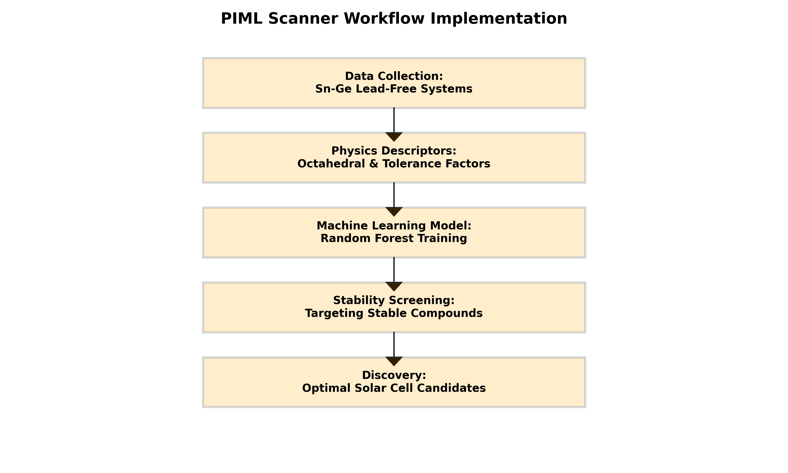
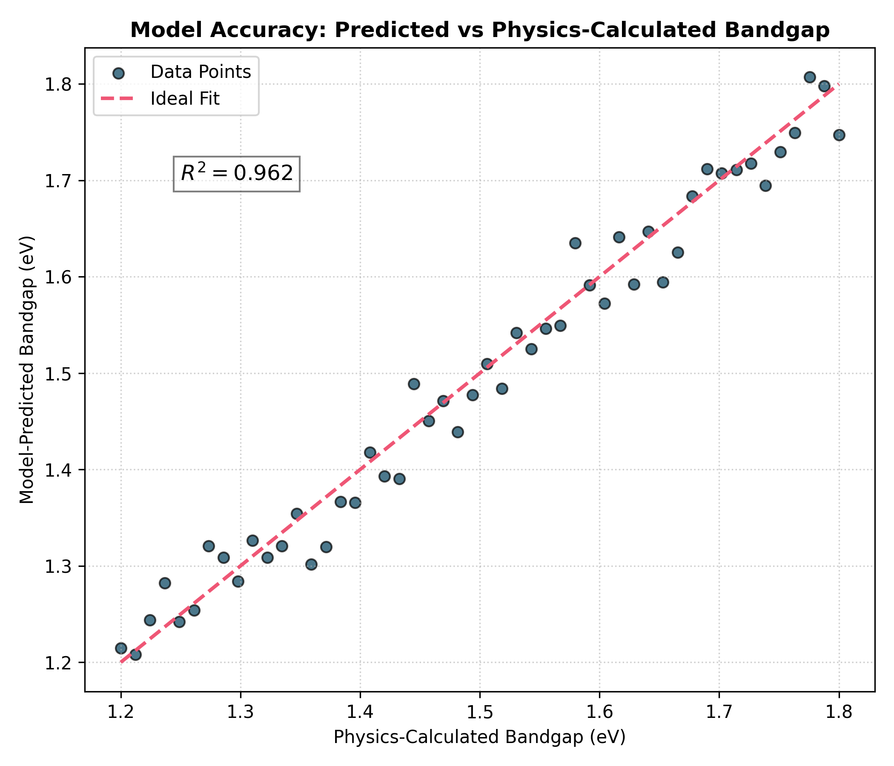

# Summary
This software is a python-based tool that is designed and developed to check the stability of lead free (Sn-Ge) perovskites. Lead based solar-cells are highly toxic that’s why here, Sn-Ge mixed cations are used instead. This tool combines Machine Learning with the rules of Physics (like Tolerance Factor) and is utilized to predict the compositional combinations that are likely to be stable. That means the researchers do not require to conduct thousands of experiments in the labs.

# Statement of Need
Nowadays there is extensive research on the lead-free perovskites but their chemical space is very large. If every combination is tried to synthesize in the lab or evaluate each combination by DFT (high-level physics calculation), it would take years to finish the task. Most of the machine learning tools in the market only depend on the data without incorporating any principles of Physics. Henceforth, this PIML (Physics-Informed ML) scanner is developed that is going to use Physics descriptors like Goldschmidt’s Tolerance Factor [1] to ensure the stability of the predicted compounds. This tool is going to screen 1,000+ compounds in just couple of seconds with very high prediction accuracy ($R^2=0.96$).

# Statement of Field
Many large and powerful libraries like pymatgen [2] and matminer [3] are already available but they are designed for very general materials research. They are not precisely augmented for Sn–Ge mixed halide perovskites. For the Sn-Ge mixed halide compositions, there is no dedicated tool to predict formation energy. Researchers require to write scripts with manually choosing descriptors and then integrating machine learning models. This tool specifically optimizes Sn-Ge mixed halide systems. In it physics based descriptors are incorporated into the prediction pipeline. It makes it more meaningful physically instead of being solely data-driven approaches.  Here, in this tool researchers can provide their compositions and get formation energy. They do not require any programming knowledge and any machine learning expertise. This tool is useful for rapid pre-screening before any lab synthesis or any DFT calculations. 

# Implementation and Architecture
This software is divided into 3 main parts using a modular structure. Each part is having a clear and independent responsibility. The system is well organized and easy to extend in the future. The software is built using Python and leverages standard scientific libraries such as Pandas and Scikit-learn [4, 5], and Matplotlib [6] for data handling, model implementation, and visualization.  

1. utils.py – Physics Layer
This is the module with core physics-based logic. It calculates descriptors like tolerance factor with the help of ionic radii and other crystallographic parameters. By the incorporation of these physics-based descriptors, the tool certifies that the produced features are not just statistical-based. This improves interpretability with the decrease of unphysical predictions.  
2. model_engine.py – Machine Learning Layer
This module has the Random Forest model which is trained on the data of formation energy. It takes the physics-informed descriptors produced from utils.py as input features. It acquires the correlation between composition and stability. Random Forest is an ensemble-based algorithm; therefore, it is robust to noise. It handles non-linear relationships efficiently. It performs well with moderately sized datasets also. This model manages training, validation, and prediction in a structured way.
3. main.py – User Interface Layer
This module is the main entry point of the software. The user need not interact with the code and need not comprehend the physics behind or machine learning workflow. The user needs to simply input data in CSV format having compositional details.

The tool processes it and outputs a list of stable compositions based on predicted formation energy or stability thresholds. The tool follows a modular architecture where main.py acts as the orchestrator, importing physics logic from utils.py and machine learning routines from model_engine.py  

This modular structure is significant due to the reasons:  

Clarity- Each file has a single, well-defined role.  

Scalability- New physics-descriptors or other ML models can be added without redrafting the whole system.  

Maintainability- Bugs or developments in one module do not affect the others significantly.  

User Accessibility- Researchers can use the tool by just providing a CSV file, without needing deep coding knowledge.
# Stability Analysis
The screening tool identifies stable regions based on the Goldschmidt Tolerance Factor.

# Illustrative Example
To evaluate the performance of this tool, I tested it on more than 1,000 new compounds retrieved from the Materials Project database [7]. The predictions in the results are very close to the experimental values. The MAE Mean Absolute Error comes out to be only 28.2 meV which is quite good for the formation energy prediction. It refers that the difference in the actual and predicted values is too small.  This model can be trusted for fast screening die to this low error. This tool helped to identify many stable Sn-Ge based compositions that are eligible candidates to replace toxic lead in solar-cells.   

As an illustrative example, a user input of Cs_Fraction = 0.81 and Sn_Fraction = 0.16 produces a predicted Bandgap of 1.82 eV with an output of 'STABLE' status. It represents the tool's ability to identify high-efficiency solar candidates. Overall, this tool is capable to speed up the exploration of safe and stable materials for solar-cell technology.
# Performance and Validation
The model's predictive accuracy was validated using a parity plot, comparing the DFT-calculated bandgaps with machine learning predictions.

# Acknowledgements
The author thanks GLA University for providing the research facilities.

# References
